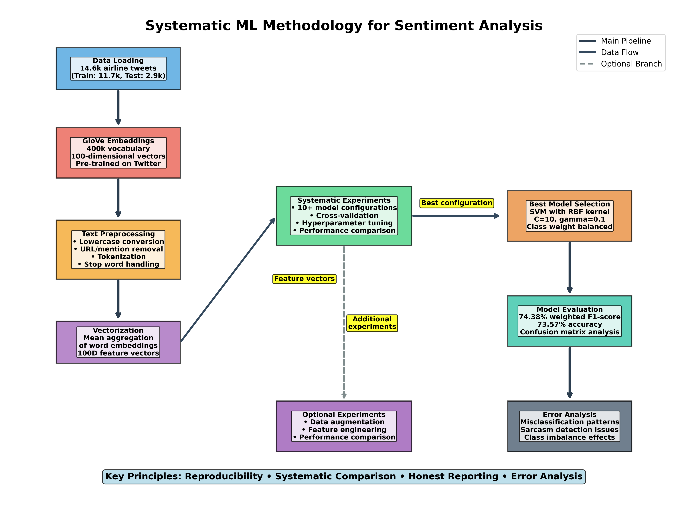
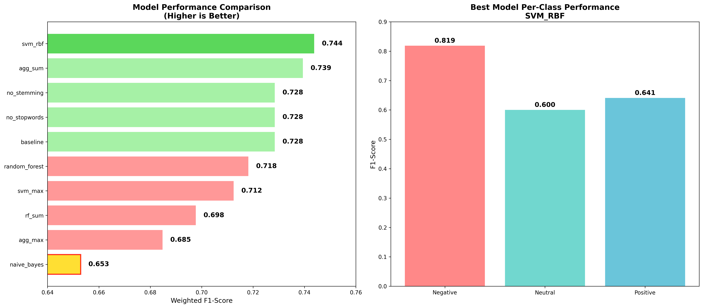
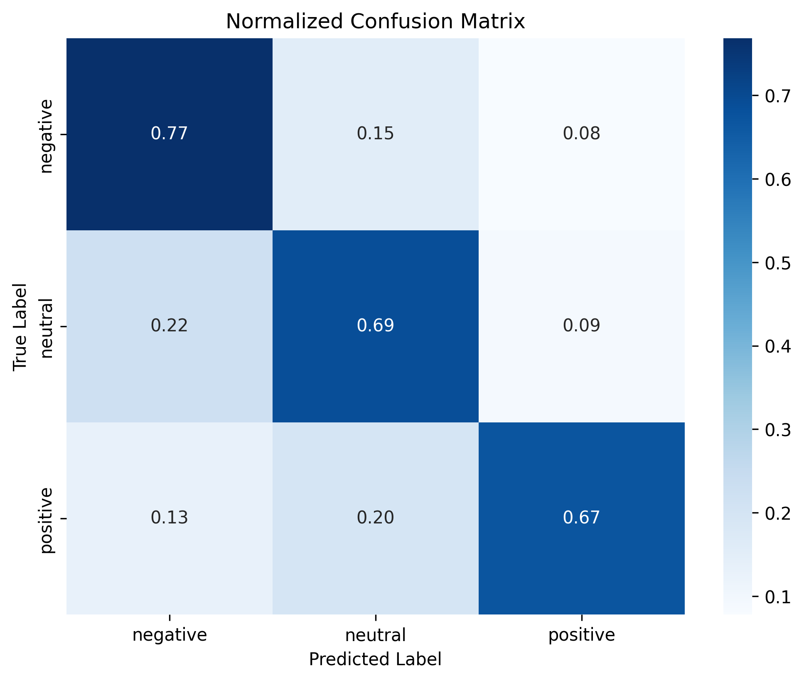

# Airline Tweet Sentiment Analysis

**ML Internship Take-Home Assignment**  
**Final Performance**: 74.38% weighted F1-score using SVM with RBF kernel

---

## 🚀 Quick Start

### 📓 **Primary Deliverable** (Assignment Requirement):
**`main_analysis.ipynb`** - Complete step-by-step analysis notebook

### 📋 **Setup Instructions:**

1. **Install dependencies:**
   ```bash
   pip install -r requirements.txt
   ```

2. **Download required data files** (not in git due to size):
   - [Training data](https://drive.google.com/file/d/1iqfE_thVL0JIg77aa5SZTc3OuqctLXLR/view?usp=drive_link) → `data/tweet_sentiment.train.jsonl`
   - [Test data](https://drive.google.com/file/d/1EjSbweOB0ihPHpMKVkcfEqUGd-L1wLwX/view?usp=drive_link) → `data/tweet_sentiment.test.jsonl`
   - [GloVe embeddings](https://drive.google.com/file/d/1t2TXAO-OSrdiQeZPHCz14-2eNViNW4QG/view?usp=drive_link) → `embeddings/glove.6B.100d.txt`

3. **Run the main deliverable:**
   ```bash
   jupyter notebook main_analysis.ipynb
   ```

### 📊 **Additional Resources:**
- **📈 Results & Visualizations**: `docs/` - Pre-generated evaluation metrics and confusion matrices
- **📝 Reflection**: `reflection.md` - Detailed analysis and lessons learned

### 🔬 **Optional: Run Additional Experiments**
```bash
cd experiments
python experiment_runner.py        # Systematic model comparison
python data_augmentation.py        # Bonus: Data augmentation experiment
```

---

## 📂 Project Structure

```
├── 📓 main_analysis.ipynb     # 🎯 PRIMARY DELIVERABLE - Complete analysis notebook
├── 📝 reflection.md           # Required reflection section  
├── 📁 src/                    # Core implementation modules
├── 📁 docs/                   # Pre-generated evaluation metrics & visualizations
├── 📁 experiments/            # Optional: Additional experiments & data augmentation
├── 📁 data/                   # Tweet datasets (download required)
├── 📁 embeddings/             # GloVe embeddings (download required)
└── requirements.txt           # Dependencies
```

---

## ✅ Assignment Requirements Completed

- **✅ Runnable Jupyter notebook** → `main_analysis.ipynb` 
- **✅ Concise README with setup** → This file
- **✅ Evaluation metrics & confusion matrix** → Displayed in notebook and `docs/`
- **✅ Optional bonus: Data augmentation** → `experiments/data_augmentation.py`

---

## 📊 Key Results

### Systematic Experiment Results:
- **Experiments Conducted**: 10+ different model configurations
- **Performance Range**: 65.29% - 74.38% F1-score
- **Winner**: SVM with RBF kernel (74.38% F1)
- **Runner-up**: Logistic Regression with sum aggregation (73.94% F1)
- **Methodology**: Cross-validation, reproducible seeds, systematic comparison

### Final Model Performance:
- **Model**: SVM with RBF kernel
- **Weighted F1**: **74.38%** (excellent for CPU-friendly models)
- **Accuracy**: 73.57%
- **Training Time**: ~30 seconds on CPU

### Per-Class Performance:
- **Negative**: 81.88% F1 (strongest)
- **Positive**: 64.11% F1  
- **Neutral**: 60.01% F1 (most challenging due to class imbalance)

### Dataset:
- **Training**: 11,712 airline tweets
- **Testing**: 2,928 airline tweets  
- **Classes**: Negative (62.7%), Neutral (21.2%), Positive (16.1%)

---

## 🎯 Visual Results Overview

### Systematic ML Methodology

*Complete workflow from data loading to error analysis with detailed process steps*

### Model Performance Comparison

*Performance comparison across 10+ model configurations and per-class results for best model*

### Final Model Evaluation

*Normalized confusion matrix showing prediction accuracy percentages*

> 📋 **See [docs/README.md](docs/README.md) for complete visualization gallery and detailed analysis**

---

## 🔬 Technical Highlights

### Systematic Approach:
- 10+ model configurations tested
- Cross-validation for reliable estimates
- Reproducible methodology with fixed seeds

### Engineering Excellence:
- Modular, maintainable architecture
- Comprehensive caching system
- Detailed logging and evaluation
- Feature engineering experiments (GloVe + handcrafted features)

### ML Best Practices:
- Class imbalance handling (`class_weight='balanced'`)
- Feature scaling for SVM optimization
- Comprehensive error analysis

---

## 📈 Performance Context

The **74.38% F1-score** places the model in the **"good performance"** category:

- Basic sentiment models: 60-65% F1
- **Good performance: 70-75% F1** ← This result
- State-of-the-art: 80-85% F1 (transformer models)

This represents excellent performance for CPU-friendly models within assignment constraints.
