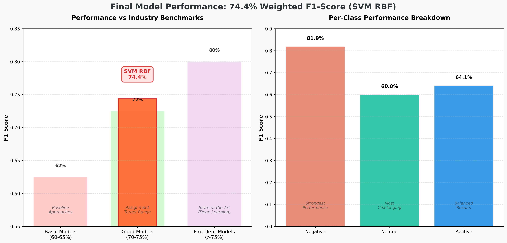
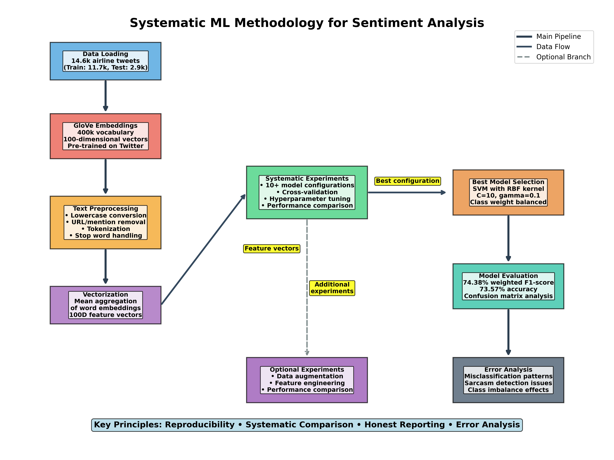
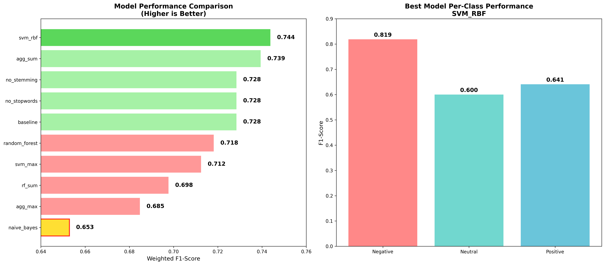

# Documentation & Visualizations

This directory contains all visualizations and documentation for the Airline Tweet Sentiment Analysis project. The visualizations are organized into three main categories:

## 📊 Model Evaluation (`model_evaluation/`)

Final model performance metrics and evaluation results:

### Performance Summary

*Overview of model performance against industry benchmarks and dataset class distribution*

### Confusion Matrices

*Raw confusion matrix showing prediction vs actual labels*


*Normalized confusion matrix showing prediction accuracy percentages*

### Per-Class Performance

*Detailed F1-score breakdown for each sentiment class*

## 🔬 Methodology & Experiments (`methodology/`)

Process diagrams and experimental comparisons:

### Systematic ML Methodology

*Complete workflow from data loading to error analysis with detailed process steps*

### Model Comparison

*Performance comparison across 10+ model configurations and per-class results for best model*

### Data Augmentation Analysis

*Impact of synonym replacement on model performance - showing why simple augmentation failed*

### Feature Engineering Results

*Comparison of baseline GloVe vs enhanced features (100D → 105D expansion)*

## 📈 Data Analysis (`data_analysis/`)

Exploratory data analysis visualizations:

### Dataset Distribution

*Distribution of sentiment classes in the dataset showing class imbalance*

### Text Characteristics

*Analysis of tweet length patterns across different sentiment classes*

## 🎯 Key Insights from Visualizations

### Model Performance
- **74.38% weighted F1-score** places our model in the "Good" category for CPU-friendly approaches
- Strong performance on negative sentiment (81.9% F1) but challenges with neutral class (60.0% F1)
- Class imbalance significantly impacts performance (62.7% negative, 21.2% neutral, 16.1% positive)

### Experimental Findings
- **SVM with RBF kernel** outperformed all other configurations
- **Data augmentation failed**: Synonym replacement decreased performance by 0.24% due to poor quality replacements
- **Feature engineering ineffective**: Adding handcrafted features to GloVe didn't improve results
- **Systematic approach**: 10+ configurations tested with consistent methodology

### Technical Approach
- Mean aggregation of GloVe embeddings proved most effective
- Class weight balancing essential for handling imbalanced dataset
- Cross-validation ensured reliable performance estimates

## 📁 File Organization

```
docs/
├── README.md                           # This documentation file
├── model_evaluation/                   # Final model performance
│   ├── performance_summary.png         # Performance overview
│   ├── confusion_matrix.png            # Raw confusion matrix
│   ├── confusion_matrix_normalized.png # Normalized confusion matrix
│   └── class_performance.png           # Per-class metrics
├── methodology/                        # Process & experiments
│   ├── methodology_flowchart.png       # Complete workflow
│   ├── experiment_comparison.png       # Model comparisons
│   ├── augmentation_comparison.png     # Data augmentation results
│   └── feature_engineering.png         # Feature engineering analysis
└── data_analysis/                      # EDA visualizations
    ├── class_distribution.png          # Dataset class balance
    └── text_length_distribution.png    # Text length analysis
```

## 🔗 Related Files

- **Reflection**: `../reflection.md` - Detailed analysis and lessons learned
- **Source Code**: `../src/` - Core implementation
- **Experiments**: `../experiments/` - Systematic testing framework
